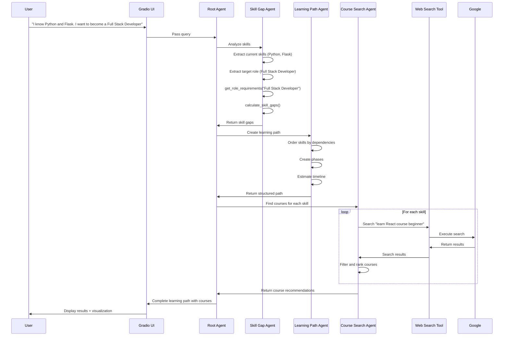

# SkillPath AI - Implementation Plan

## Project Overview

**System Name**: SkillPath AI  
**Purpose**: Help professional software engineering learners identify skill gaps and receive personalized learning paths with real-time course recommendations from the web.

**Key Simplifications**:
- ✅ Single-session interaction (no data persistence)
- ✅ Real-time course search via Google (no static course database)
- ✅ No progress tracking
- ✅ Focus on immediate value delivery

---

## Table of Contents
1. [Architecture Overview](#architecture-overview)
2. [Agent Design](#agent-design)
3. [Tool Design](#tool-design)
4. [Data Structures](#data-structures)
5. [User Flow](#user-flow)
6. [Project Structure](#project-structure)
7. [Implementation Steps](#implementation-steps)
8. [Sample Queries](#sample-queries)

---

## Architecture Overview

### System Architecture Diagram

```mermaid
graph TB
    subgraph UI["User Interface - Gradio"]
        Chat["Chat Interface"]
        Examples["Example Queries"]
        Visualization["Skill Gap Visualization"]
    end
    
    subgraph ADK["Google ADK Runner"]
        Session["Session Service"]
        Memory["Memory Service"]
        Orchestrator["Agent Orchestration"]
    end
    
    subgraph Root["Root Learning Path Orchestrator Agent"]
        Analyze["Analyzes user query"]
        Route["Routes to specialized agent"]
        LoadMem["Uses load_memory tool"]
        Present["Presents results"]
    end
    
    subgraph SkillAgent["Skill Gap Analysis Agent"]
        Extract["Extracts current skills & target role"]
        GetReq["Gets role requirements"]
        CalcGaps["Calculates skill gaps"]
        Prioritize["Prioritizes skills"]
    end
    
    subgraph PathAgent["Learning Path Creation Agent"]
        Sequence["Creates skill sequence"]
        Dependencies["Handles dependencies"]
        Timeline["Estimates timeline"]
        Structure["Structures phases"]
    end
    
    subgraph CourseAgent["Course Search Agent"]
        SearchWeb["Searches courses via Google"]
        Filter["Filters results"]
        Rank["Ranks by relevance"]
        Extract2["Extracts course details"]
    end
    
    subgraph Tools["Tools Layer"]
        GetRole["get_role_requirements"]
        CalcGap["calculate_skill_gaps"]
        CreatePath["create_learning_path"]
        WebSearch["web_search (Google)"]
        WebFetch["web_fetch (Get course details)"]
    end
    
    subgraph Data["Static Data (In-Memory)"]
        RoleData["Role Requirements JSON"]
        SkillData["Skills Database JSON"]
    end
    
    Chat --> Session
    Session --> Analyze
    Analyze --> Extract
    Extract --> GetReq
    GetReq --> RoleData
    CalcGaps --> Sequence
    Sequence --> SearchWeb
    SearchWeb --> WebSearch
    WebSearch --> Filter
    Filter --> Present
    
    classDef uiStyle fill:#e1f5ff,stroke:#2E86AB,stroke-width:2px
    classDef adkStyle fill:#fff4e1,stroke:#FF6B35,stroke-width:2px
    classDef rootStyle fill:#ffe1f5,stroke:#9C27B0,stroke-width:2px
    classDef agentStyle fill:#e1ffe1,stroke:#4CAF50,stroke-width:2px
    classDef toolsStyle fill:#f5e1ff,stroke:#9C27B0,stroke-width:2px
    classDef dataStyle fill:#ffe1e1,stroke:#F44336,stroke-width:2px
    
    class UI uiStyle
    class ADK adkStyle
    class Root rootStyle
    class SkillAgent,PathAgent,CourseAgent agentStyle
    class Tools toolsStyle
    class Data dataStyle
```



### Key Differences from GHG System

| Aspect | GHG System | SkillPath AI |
|--------|-----------|--------------|
| **Data Persistence** | MongoDB storage | None (session-only) |
| **Data Source** | Static CSV/JSON | Real-time web search |
| **Progress Tracking** | Yes | No |
| **Saving Agent** | Yes | No (removed) |
| **Course Data** | Pre-loaded | Searched on demand |
| **Complexity** | 4 agents | 3 agents |

---

## Agent Design

### 1. Root Agent: `learning_path_orchestrator_agent`

**Purpose**: Main coordinator that routes queries and orchestrates responses

**Responsibilities**:
- Understand user's current skills and target role
- Route to skill gap analysis agent
- Route to learning path creation agent
- Route to course search agent
- Present comprehensive results to user

**Tools**:
- `AgentTool(skill_gap_analysis_agent)` - Delegate skill analysis
- `AgentTool(learning_path_creation_agent)` - Delegate path creation
- `AgentTool(course_search_agent)` - Delegate course search
- `load_memory` - Access conversation history

**Input**: Natural language query from user

**Output**: Comprehensive learning path with skill gaps, structured phases, and real courses

---

### 2. Skill Gap Analysis Agent: `skill_gap_analysis_agent`

**Purpose**: Identifies skill gaps between current state and target role

**Responsibilities**:
- Extract user's current skills from conversation
- Extract target role/position
- Retrieve required skills for target role
- Calculate gaps (missing skills + skill level differences)
- Prioritize skills by importance and urgency

**Tools**:
- `get_role_requirements(role_name: str)` - Get required skills for a role
- `calculate_skill_gaps(current_skills: dict, required_skills: dict)` - Compute gaps

**Input Example**:
```python
{
    "current_skills": {
        "Python": "intermediate",
        "Flask": "beginner",
        "Git": "beginner"
    },
    "target_role": "Full Stack Developer"
}
```

**Output Example**:
```python
{
    "target_role": "Full Stack Developer",
    "skill_gaps": [
        {
            "skill_name": "React",
            "current_level": "none",
            "required_level": "intermediate",
            "category": "Frontend Framework",
            "priority": 1,
            "importance": "critical"
        },
        {
            "skill_name": "Node.js",
            "current_level": "none",
            "required_level": "intermediate",
            "category": "Backend Framework",
            "priority": 2,
            "importance": "critical"
        },
        {
            "skill_name": "PostgreSQL",
            "current_level": "none",
            "required_level": "intermediate",
            "category": "Database",
            "priority": 3,
            "importance": "high"
        }
    ],
    "existing_skills": ["Python", "Flask", "Git"],
    "total_gaps": 8
}
```

---

### 3. Learning Path Creation Agent: `learning_path_creation_agent`

**Purpose**: Creates a structured, sequential learning roadmap

**Responsibilities**:
- Take skill gaps as input
- Order skills based on dependencies (e.g., HTML before React)
- Create learning phases (Foundation → Intermediate → Advanced)
- Estimate learning duration per skill
- Generate milestones

**Tools**:
- `create_learning_path(skill_gaps: list, user_time_availability: int)` - Generate structured path

**Input**: Skill gaps from previous agent

**Output Example**:
```python
{
    "learning_path_id": "generated-uuid",
    "target_role": "Full Stack Developer",
    "total_estimated_weeks": 24,
    "phases": [
        {
            "phase_number": 1,
            "phase_name": "Frontend Foundation",
            "duration_weeks": 8,
            "skills": [
                {
                    "skill_name": "HTML & CSS",
                    "estimated_hours": 40,
                    "sequence": 1,
                    "why_important": "Foundation for all web development"
                },
                {
                    "skill_name": "JavaScript",
                    "estimated_hours": 60,
                    "sequence": 2,
                    "why_important": "Core language for frontend development"
                },
                {
                    "skill_name": "React",
                    "estimated_hours": 50,
                    "sequence": 3,
                    "why_important": "Most popular frontend framework"
                }
            ],
            "milestone": "Build a responsive portfolio website with React"
        },
        {
            "phase_number": 2,
            "phase_name": "Backend Development",
            "duration_weeks": 8,
            "skills": [
                {
                    "skill_name": "Node.js",
                    "estimated_hours": 50,
                    "sequence": 1
                },
                {
                    "skill_name": "Express.js",
                    "estimated_hours": 40,
                    "sequence": 2
                },
                {
                    "skill_name": "PostgreSQL",
                    "estimated_hours": 40,
                    "sequence": 3
                }
            ],
            "milestone": "Build a RESTful API with authentication"
        },
        {
            "phase_number": 3,
            "phase_name": "Full Stack Integration",
            "duration_weeks": 8,
            "skills": [
                {
                    "skill_name": "REST APIs",
                    "estimated_hours": 30,
                    "sequence": 1
                },
                {
                    "skill_name": "Docker",
                    "estimated_hours": 35,
                    "sequence": 2
                },
                {
                    "skill_name": "CI/CD",
                    "estimated_hours": 35,
                    "sequence": 3
                }
            ],
            "milestone": "Deploy a full-stack application to production"
        }
    ]
}
```

---

### 4. Course Search Agent: `course_search_agent`

**Purpose**: Finds real courses from the web for each skill

**Responsibilities**:
- For each skill in the learning path, search for courses
- Use Google web search to find courses from platforms like:
  - Coursera, Udemy, edX, Pluralsight, LinkedIn Learning
  - FreeCodeCamp, The Odin Project, MDN
  - YouTube playlists
- Filter and rank results by quality indicators
- Extract course details (title, provider, URL, estimated duration)

**Tools**:
- `web_search(query: str)` - Search Google for courses
- `web_fetch(url: str)` - Get detailed course information from URLs
- `rank_courses(courses: list, skill: str)` - Rank by relevance

**Search Query Strategy**:
- Pattern: `"learn {skill_name} online course {level}"`
- Examples:
  - "learn React online course beginner"
  - "learn Node.js tutorial intermediate"
  - "learn PostgreSQL course professional"

**Output Example**:
```python
{
    "skill_name": "React",
    "courses": [
        {
            "title": "React - The Complete Guide 2024",
            "provider": "Udemy",
            "url": "https://www.udemy.com/course/react-the-complete-guide/",
            "instructor": "Maximilian Schwarzmüller",
            "rating": 4.6,
            "estimated_hours": 48,
            "level": "beginner to advanced",
            "price": "Paid",
            "description": "Dive in and learn React from scratch..."
        },
        {
            "title": "React Official Tutorial",
            "provider": "React.dev",
            "url": "https://react.dev/learn",
            "estimated_hours": 20,
            "level": "beginner",
            "price": "Free",
            "description": "Official React documentation and tutorial"
        },
        {
            "title": "Full React Course 2024",
            "provider": "freeCodeCamp (YouTube)",
            "url": "https://www.youtube.com/watch?v=...",
            "estimated_hours": 12,
            "level": "beginner",
            "price": "Free"
        }
    ]
}
```

**Filtering Strategy**:
- Prioritize courses from known platforms
- Look for high ratings (4.0+)
- Prefer comprehensive courses (30+ hours for major skills)
- Include both free and paid options
- Return top 3-5 courses per skill

---

## Tool Design

### Tool 1: `get_role_requirements`

**File**: `tools/tool_get_role_requirements.py`

**Purpose**: Retrieve required skills for a given software engineering role

**Input**:
```python
role_name: str  # e.g., "Full Stack Developer"
```

**Output**:
```python
{
    "role_name": "Full Stack Developer",
    "experience_level": "mid-level",
    "required_skills": [
        {
            "skill_name": "HTML & CSS",
            "category": "Frontend",
            "required_level": "intermediate",
            "importance": "critical"
        },
        {
            "skill_name": "JavaScript",
            "category": "Programming Language",
            "required_level": "advanced",
            "importance": "critical"
        },
        # ... more skills
    ]
}
```

**Data Source**: Static JSON file with predefined roles

---

### Tool 2: `calculate_skill_gaps`

**File**: `tools/tool_calculate_skill_gaps.py`

**Purpose**: Compare current skills with required skills and identify gaps

**Input**:
```python
{
    "current_skills": {
        "Python": "intermediate",
        "Git": "beginner"
    },
    "required_skills": [
        {
            "skill_name": "Python",
            "required_level": "advanced"
        },
        {
            "skill_name": "React",
            "required_level": "intermediate"
        }
    ]
}
```

**Logic**:
1. For each required skill:
   - If not in current_skills → Gap = "Missing skill"
   - If in current_skills but lower level → Gap = "Level upgrade needed"
2. Assign priority based on importance
3. Calculate gap severity (high/medium/low)

**Output**: List of skill gaps with priorities

---

### Tool 3: `create_learning_path`

**File**: `tools/tool_create_learning_path.py`

**Purpose**: Generate structured learning path with phases

**Input**:
```python
{
    "skill_gaps": [...],  # From calculate_skill_gaps
    "user_time_availability": 10  # hours per week (optional)
}
```

**Logic**:
1. Group skills by category (Frontend, Backend, DevOps, etc.)
2. Order by dependencies (e.g., JavaScript before React)
3. Create phases (Foundation → Intermediate → Advanced)
4. Estimate duration (skill_complexity × learning_factor)
5. Add milestones (project-based)

**Output**: Structured learning path with phases

---

### Tool 4: `web_search` (Built-in ADK tool)

**Purpose**: Search Google for courses

**Usage in Agent**:
```python
# Search for React courses
results = web_search("learn React online course beginner 2024")
```

**Note**: This is a built-in tool provided by Google ADK

---

### Tool 5: `web_fetch` (Built-in ADK tool)

**Purpose**: Fetch full page content for course details

**Usage in Agent**:
```python
# Get course page details
course_details = web_fetch("https://www.udemy.com/course/react-the-complete-guide/")
```

**Note**: This is a built-in tool provided by Google ADK

---

### Tool 6: `rank_courses`

**File**: `tools/tool_rank_courses.py`

**Purpose**: Rank search results by relevance and quality

**Input**:
```python
{
    "courses": [...],  # Courses from web search
    "skill": "React",
    "target_level": "intermediate"
}
```

**Ranking Factors**:
1. **Platform reputation**: Coursera, Udemy, edX (higher weight)
2. **Rating**: 4.5+ stars preferred
3. **Relevance**: Title/description matches skill name
4. **Completeness**: Comprehensive courses preferred
5. **Currency**: Recent courses (2023-2024)

**Output**: Ranked list of top 3-5 courses

---

## Data Structures

### Pydantic Models (DTOs)

**File**: `data_types/dto.py`

```python
from pydantic import BaseModel, Field
from typing import List, Dict, Optional
from enum import Enum

# Enums
class SkillLevel(str, Enum):
    NONE = "none"
    BEGINNER = "beginner"
    INTERMEDIATE = "intermediate"
    ADVANCED = "advanced"
    EXPERT = "expert"

class SkillCategory(str, Enum):
    FRONTEND = "Frontend"
    BACKEND = "Backend"
    DATABASE = "Database"
    DEVOPS = "DevOps"
    CLOUD = "Cloud"
    MOBILE = "Mobile"
    PROGRAMMING_LANGUAGE = "Programming Language"
    TOOLS = "Tools"
    SOFT_SKILLS = "Soft Skills"

class SkillImportance(str, Enum):
    CRITICAL = "critical"
    HIGH = "high"
    MEDIUM = "medium"
    LOW = "low"

# Skill Gap Models
class SkillRequirement(BaseModel):
    skill_name: str
    category: SkillCategory
    required_level: SkillLevel
    importance: SkillImportance
    description: Optional[str] = None

class RoleRequirements(BaseModel):
    role_name: str
    experience_level: str
    required_skills: List[SkillRequirement]
    
class SkillGap(BaseModel):
    skill_name: str
    current_level: SkillLevel
    required_level: SkillLevel
    category: SkillCategory
    priority: int
    importance: SkillImportance
    gap_severity: str  # "high", "medium", "low"

class SkillGapAnalysis(BaseModel):
    target_role: str
    skill_gaps: List[SkillGap]
    existing_skills: List[str]
    total_gaps: int

# Learning Path Models
class SkillToLearn(BaseModel):
    skill_name: str
    estimated_hours: int
    sequence: int
    why_important: str
    prerequisites: List[str] = []

class LearningPhase(BaseModel):
    phase_number: int
    phase_name: str
    duration_weeks: int
    skills: List[SkillToLearn]
    milestone: str

class LearningPath(BaseModel):
    target_role: str
    total_estimated_weeks: int
    phases: List[LearningPhase]

# Course Models
class Course(BaseModel):
    title: str
    provider: str
    url: str
    instructor: Optional[str] = None
    rating: Optional[float] = None
    estimated_hours: Optional[int] = None
    level: str
    price: str  # "Free", "Paid", "$X"
    description: Optional[str] = None

class CourseRecommendations(BaseModel):
    skill_name: str
    courses: List[Course]

# Final Output
class LearningPathOutput(BaseModel):
    skill_gap_analysis: SkillGapAnalysis
    learning_path: LearningPath
    course_recommendations: List[CourseRecommendations]
```

---

### Static Data Files

#### File: `data/roles_data.json`

Contains predefined role requirements for common software engineering roles.

```json
{
    "roles": [
        {
            "role_name": "Full Stack Developer",
            "experience_level": "mid-level",
            "required_skills": [
                {
                    "skill_name": "HTML & CSS",
                    "category": "Frontend",
                    "required_level": "intermediate",
                    "importance": "critical",
                    "description": "Structure and style web pages"
                },
                {
                    "skill_name": "JavaScript",
                    "category": "Programming Language",
                    "required_level": "advanced",
                    "importance": "critical",
                    "description": "Core language for web development"
                },
                {
                    "skill_name": "React",
                    "category": "Frontend",
                    "required_level": "intermediate",
                    "importance": "critical",
                    "description": "Build interactive UIs"
                },
                {
                    "skill_name": "Node.js",
                    "category": "Backend",
                    "required_level": "intermediate",
                    "importance": "critical",
                    "description": "JavaScript runtime for backend"
                },
                {
                    "skill_name": "Express.js",
                    "category": "Backend",
                    "required_level": "intermediate",
                    "importance": "high",
                    "description": "Web framework for Node.js"
                },
                {
                    "skill_name": "PostgreSQL",
                    "category": "Database",
                    "required_level": "intermediate",
                    "importance": "high",
                    "description": "Relational database management"
                },
                {
                    "skill_name": "MongoDB",
                    "category": "Database",
                    "required_level": "beginner",
                    "importance": "medium",
                    "description": "NoSQL document database"
                },
                {
                    "skill_name": "Git",
                    "category": "Tools",
                    "required_level": "intermediate",
                    "importance": "critical",
                    "description": "Version control system"
                },
                {
                    "skill_name": "REST APIs",
                    "category": "Backend",
                    "required_level": "intermediate",
                    "importance": "critical",
                    "description": "Design and consume APIs"
                },
                {
                    "skill_name": "Docker",
                    "category": "DevOps",
                    "required_level": "beginner",
                    "importance": "high",
                    "description": "Containerization platform"
                },
                {
                    "skill_name": "Testing (Jest, Pytest)",
                    "category": "Tools",
                    "required_level": "intermediate",
                    "importance": "high",
                    "description": "Write automated tests"
                },
                {
                    "skill_name": "CI/CD",
                    "category": "DevOps",
                    "required_level": "beginner",
                    "importance": "medium",
                    "description": "Continuous integration and deployment"
                }
            ]
        },
        {
            "role_name": "Frontend Developer",
            "experience_level": "mid-level",
            "required_skills": [
                {
                    "skill_name": "HTML & CSS",
                    "category": "Frontend",
                    "required_level": "advanced",
                    "importance": "critical"
                },
                {
                    "skill_name": "JavaScript",
                    "category": "Programming Language",
                    "required_level": "advanced",
                    "importance": "critical"
                },
                {
                    "skill_name": "React",
                    "category": "Frontend",
                    "required_level": "advanced",
                    "importance": "critical"
                },
                {
                    "skill_name": "TypeScript",
                    "category": "Programming Language",
                    "required_level": "intermediate",
                    "importance": "high"
                },
                {
                    "skill_name": "State Management (Redux/Zustand)",
                    "category": "Frontend",
                    "required_level": "intermediate",
                    "importance": "high"
                },
                {
                    "skill_name": "Responsive Design",
                    "category": "Frontend",
                    "required_level": "advanced",
                    "importance": "critical"
                },
                {
                    "skill_name": "Webpack/Vite",
                    "category": "Tools",
                    "required_level": "beginner",
                    "importance": "medium"
                },
                {
                    "skill_name": "Testing (Jest, React Testing Library)",
                    "category": "Tools",
                    "required_level": "intermediate",
                    "importance": "high"
                },
                {
                    "skill_name": "Git",
                    "category": "Tools",
                    "required_level": "intermediate",
                    "importance": "critical"
                },
                {
                    "skill_name": "REST APIs",
                    "category": "Backend",
                    "required_level": "beginner",
                    "importance": "high"
                }
            ]
        },
        {
            "role_name": "Backend Developer",
            "experience_level": "mid-level",
            "required_skills": [
                {
                    "skill_name": "Python",
                    "category": "Programming Language",
                    "required_level": "advanced",
                    "importance": "critical"
                },
                {
                    "skill_name": "Django/Flask",
                    "category": "Backend",
                    "required_level": "advanced",
                    "importance": "critical"
                },
                {
                    "skill_name": "PostgreSQL",
                    "category": "Database",
                    "required_level": "advanced",
                    "importance": "critical"
                },
                {
                    "skill_name": "REST APIs",
                    "category": "Backend",
                    "required_level": "advanced",
                    "importance": "critical"
                },
                {
                    "skill_name": "SQL",
                    "category": "Database",
                    "required_level": "advanced",
                    "importance": "critical"
                },
                {
                    "skill_name": "Redis",
                    "category": "Database",
                    "required_level": "intermediate",
                    "importance": "high"
                },
                {
                    "skill_name": "Docker",
                    "category": "DevOps",
                    "required_level": "intermediate",
                    "importance": "high"
                },
                {
                    "skill_name": "Git",
                    "category": "Tools",
                    "required_level": "intermediate",
                    "importance": "critical"
                },
                {
                    "skill_name": "Testing (Pytest)",
                    "category": "Tools",
                    "required_level": "intermediate",
                    "importance": "high"
                },
                {
                    "skill_name": "Authentication & Authorization",
                    "category": "Backend",
                    "required_level": "intermediate",
                    "importance": "high"
                }
            ]
        },
        {
            "role_name": "DevOps Engineer",
            "experience_level": "mid-level",
            "required_skills": [
                {
                    "skill_name": "Linux",
                    "category": "Tools",
                    "required_level": "advanced",
                    "importance": "critical"
                },
                {
                    "skill_name": "Docker",
                    "category": "DevOps",
                    "required_level": "advanced",
                    "importance": "critical"
                },
                {
                    "skill_name": "Kubernetes",
                    "category": "DevOps",
                    "required_level": "intermediate",
                    "importance": "critical"
                },
                {
                    "skill_name": "CI/CD (Jenkins/GitLab CI)",
                    "category": "DevOps",
                    "required_level": "advanced",
                    "importance": "critical"
                },
                {
                    "skill_name": "AWS/Azure/GCP",
                    "category": "Cloud",
                    "required_level": "intermediate",
                    "importance": "critical"
                },
                {
                    "skill_name": "Terraform",
                    "category": "DevOps",
                    "required_level": "intermediate",
                    "importance": "high"
                },
                {
                    "skill_name": "Ansible",
                    "category": "DevOps",
                    "required_level": "beginner",
                    "importance": "medium"
                },
                {
                    "skill_name": "Monitoring (Prometheus/Grafana)",
                    "category": "DevOps",
                    "required_level": "intermediate",
                    "importance": "high"
                },
                {
                    "skill_name": "Bash/Python Scripting",
                    "category": "Programming Language",
                    "required_level": "intermediate",
                    "importance": "high"
                },
                {
                    "skill_name": "Git",
                    "category": "Tools",
                    "required_level": "intermediate",
                    "importance": "critical"
                }
            ]
        },
        {
            "role_name": "Machine Learning Engineer",
            "experience_level": "mid-level",
            "required_skills": [
                {
                    "skill_name": "Python",
                    "category": "Programming Language",
                    "required_level": "advanced",
                    "importance": "critical"
                },
                {
                    "skill_name": "Machine Learning Fundamentals",
                    "category": "Programming Language",
                    "required_level": "advanced",
                    "importance": "critical"
                },
                {
                    "skill_name": "TensorFlow/PyTorch",
                    "category": "Tools",
                    "required_level": "advanced",
                    "importance": "critical"
                },
                {
                    "skill_name": "NumPy/Pandas",
                    "category": "Tools",
                    "required_level": "advanced",
                    "importance": "critical"
                },
                {
                    "skill_name": "SQL",
                    "category": "Database",
                    "required_level": "intermediate",
                    "importance": "high"
                },
                {
                    "skill_name": "Data Preprocessing",
                    "category": "Tools",
                    "required_level": "advanced",
                    "importance": "critical"
                },
                {
                    "skill_name": "Model Deployment",
                    "category": "DevOps",
                    "required_level": "intermediate",
                    "importance": "high"
                },
                {
                    "skill_name": "Docker",
                    "category": "DevOps",
                    "required_level": "beginner",
                    "importance": "medium"
                },
                {
                    "skill_name": "Git",
                    "category": "Tools",
                    "required_level": "intermediate",
                    "importance": "high"
                },
                {
                    "skill_name": "Cloud Platforms (AWS/GCP)",
                    "category": "Cloud",
                    "required_level": "beginner",
                    "importance": "medium"
                }
            ]
        },
        {
            "role_name": "Mobile Developer (React Native)",
            "experience_level": "mid-level",
            "required_skills": [
                {
                    "skill_name": "JavaScript",
                    "category": "Programming Language",
                    "required_level": "advanced",
                    "importance": "critical"
                },
                {
                    "skill_name": "React",
                    "category": "Frontend",
                    "required_level": "advanced",
                    "importance": "critical"
                },
                {
                    "skill_name": "React Native",
                    "category": "Mobile",
                    "required_level": "advanced",
                    "importance": "critical"
                },
                {
                    "skill_name": "TypeScript",
                    "category": "Programming Language",
                    "required_level": "intermediate",
                    "importance": "high"
                },
                {
                    "skill_name": "Mobile UI/UX",
                    "category": "Frontend",
                    "required_level": "intermediate",
                    "importance": "high"
                },
                {
                    "skill_name": "REST APIs",
                    "category": "Backend",
                    "required_level": "intermediate",
                    "importance": "high"
                },
                {
                    "skill_name": "State Management (Redux)",
                    "category": "Frontend",
                    "required_level": "intermediate",
                    "importance": "high"
                },
                {
                    "skill_name": "Git",
                    "category": "Tools",
                    "required_level": "intermediate",
                    "importance": "critical"
                },
                {
                    "skill_name": "Testing (Jest)",
                    "category": "Tools",
                    "required_level": "beginner",
                    "importance": "medium"
                }
            ]
        },
        {
            "role_name": "Data Engineer",
            "experience_level": "mid-level",
            "required_skills": [
                {
                    "skill_name": "Python",
                    "category": "Programming Language",
                    "required_level": "advanced",
                    "importance": "critical"
                },
                {
                    "skill_name": "SQL",
                    "category": "Database",
                    "required_level": "advanced",
                    "importance": "critical"
                },
                {
                    "skill_name": "PostgreSQL/MySQL",
                    "category": "Database",
                    "required_level": "advanced",
                    "importance": "critical"
                },
                {
                    "skill_name": "Apache Spark",
                    "category": "Tools",
                    "required_level": "intermediate",
                    "importance": "high"
                },
                {
                    "skill_name": "Apache Airflow",
                    "category": "Tools",
                    "required_level": "intermediate",
                    "importance": "high"
                },
                {
                    "skill_name": "ETL Pipelines",
                    "category": "Backend",
                    "required_level": "advanced",
                    "importance": "critical"
                },
                {
                    "skill_name": "Data Warehousing",
                    "category": "Database",
                    "required_level": "intermediate",
                    "importance": "high"
                },
                {
                    "skill_name": "AWS/GCP",
                    "category": "Cloud",
                    "required_level": "intermediate",
                    "importance": "high"
                },
                {
                    "skill_name": "Docker",
                    "category": "DevOps",
                    "required_level": "beginner",
                    "importance": "medium"
                },
                {
                    "skill_name": "Git",
                    "category": "Tools",
                    "required_level": "intermediate",
                    "importance": "high"
                }
            ]
        }
    ]
}
```

#### File: `data/skill_dependencies.json`

Defines learning prerequisites and dependencies.

```json
{
    "dependencies": {
        "React": ["JavaScript", "HTML & CSS"],
        "Node.js": ["JavaScript"],
        "Express.js": ["Node.js"],
        "TypeScript": ["JavaScript"],
        "PostgreSQL": ["SQL"],
        "Docker": [],
        "Kubernetes": ["Docker"],
        "Redux": ["React"],
        "Next.js": ["React"],
        "Django": ["Python"],
        "Flask": ["Python"],
        "TensorFlow": ["Python", "Machine Learning Fundamentals"],
        "PyTorch": ["Python", "Machine Learning Fundamentals"],
        "React Native": ["React", "JavaScript"],
        "Apache Spark": ["Python", "SQL"],
        "Terraform": ["Cloud Platforms (AWS/GCP)"],
        "CI/CD": ["Git"]
    }
}
```

---

## User Flow

### Flow Diagram



### Example Interaction

**User Input**:
```
"I'm a backend developer with 2 years of experience in Python and Django. 
I know PostgreSQL and Git. I want to transition to a Full Stack Developer role."
```

**System Processing**:

1. **Root Agent** receives query and routes to **Skill Gap Agent**

2. **Skill Gap Agent**:
   - Extracts: Current skills = {Python: advanced, Django: intermediate, PostgreSQL: intermediate, Git: intermediate}
   - Extracts: Target role = "Full Stack Developer"
   - Calls `get_role_requirements("Full Stack Developer")`
   - Calls `calculate_skill_gaps(current, required)`
   - Returns gaps: React, JavaScript, Node.js, Express, Docker, etc.

3. **Learning Path Agent**:
   - Takes skill gaps
   - Orders by dependencies (JavaScript → React, Node.js → Express)
   - Creates 3 phases:
     - Phase 1: Frontend Foundation (JavaScript, HTML/CSS, React)
     - Phase 2: Backend Expansion (Node.js, Express)
     - Phase 3: DevOps & Deployment (Docker, CI/CD)
   - Estimates 24 weeks total

4. **Course Search Agent**:
   - For JavaScript: Searches "learn JavaScript online course beginner"
   - Finds: 
     - "JavaScript - The Complete Guide 2024" (Udemy)
     - "JavaScript.info" (Free)
     - "Eloquent JavaScript" (Book + Free)
   - For React: Searches "learn React course intermediate"
   - Finds:
     - "React - The Complete Guide" (Udemy)
     - "React Official Tutorial" (react.dev)
     - "Full React Course" (freeCodeCamp)
   - Repeats for all skills

5. **Root Agent** formats and presents:

**User Output**:
```
🎯 Your Learning Path to Full Stack Developer

📊 Skill Gap Analysis:
You have 4 existing skills and need to learn 8 new skills.

Critical gaps:
• JavaScript (Frontend) - Priority 1
• React (Frontend) - Priority 2
• Node.js (Backend) - Priority 3

━━━━━━━━━━━━━━━━━━━━━━━━━━━━━━━━━━━━━━━━

📚 Your Personalized Learning Path (24 weeks)

Phase 1: Frontend Foundation (8 weeks)
├─ JavaScript (60 hours)
│  └─ Why: Core language for web development
├─ HTML & CSS (40 hours)
│  └─ Why: Foundation for all web development
└─ React (50 hours)
   └─ Why: Most popular frontend framework

Milestone: Build a portfolio website with React

Recommended Courses for JavaScript:
1. JavaScript - The Complete Guide 2024 (Udemy) ⭐ 4.7
   → https://udemy.com/course/javascript-complete-guide
   → 52 hours | Beginner to Advanced | Paid
   
2. JavaScript.info - The Modern JavaScript Tutorial (Free)
   → https://javascript.info
   → Self-paced | Free

3. Eloquent JavaScript (Book + Interactive)
   → https://eloquentjavascript.net
   → Free

[... continues with Phase 2 and Phase 3 ...]

━━━━━━━━━━━━━━━━━━━━━━━━━━━━━━━━━━━━━━━━

💡 Next Steps:
1. Start with JavaScript fundamentals
2. Build small projects as you learn
3. Join developer communities (Reddit, Discord)
4. Practice on coding challenge platforms

Good luck on your learning journey! 🚀
```

---

## Project Structure

```
skillpath-ai/
├── agents/
│   ├── __init__.py
│   ├── root_learning_path_orchestrator_agent.py
│   ├── skill_gap_analysis_agent.py
│   ├── learning_path_creation_agent.py
│   └── course_search_agent.py
│
├── tools/
│   ├── __init__.py
│   ├── tool_get_role_requirements.py
│   ├── tool_calculate_skill_gaps.py
│   ├── tool_create_learning_path.py
│   └── tool_rank_courses.py
│
├── data/
│   ├── __init__.py
│   ├── roles_data.json
│   ├── skill_dependencies.json
│   └── data_loader.py
│
├── data_types/
│   ├── __init__.py
│   └── dto.py
│
├── utils/
│   ├── __init__.py
│   └── utils.py
│
├── config/
│   ├── __init__.py
│   └── retry_config.py
│
├── visualizations/
│   ├── __init__.py
│   └── skill_gap_viz.py
│
├── gradio_app.py
├── requirements.txt
├── .env.example
└── README.md
```

### File Descriptions

**`agents/root_learning_path_orchestrator_agent.py`**
- Main orchestrator agent
- Routes queries to specialized agents
- Formats final output

**`agents/skill_gap_analysis_agent.py`**
- Extracts current skills and target role
- Calls get_role_requirements tool
- Calls calculate_skill_gaps tool

**`agents/learning_path_creation_agent.py`**
- Takes skill gaps as input
- Creates structured learning path with phases
- Estimates timelines

**`agents/course_search_agent.py`**
- Searches web for courses using web_search
- Filters and ranks results
- Extracts course details

**`tools/tool_get_role_requirements.py`**
- Loads roles_data.json
- Returns required skills for a role

**`tools/tool_calculate_skill_gaps.py`**
- Compares current vs required skills
- Calculates gaps and priorities

**`tools/tool_create_learning_path.py`**
- Orders skills by dependencies
- Creates phases
- Estimates duration

**`tools/tool_rank_courses.py`**
- Ranks course search results
- Filters by quality indicators

**`data/data_loader.py`**
- Loads JSON files into memory
- Provides helper functions to access data

**`visualizations/skill_gap_viz.py`**
- Creates radar chart for skill comparison
- Visualizes learning path timeline

**`gradio_app.py`**
- Main application entry point
- Gradio UI setup
- Agent orchestration

---

## Implementation Steps

### Phase 1: Setup & Foundation (Day 1)

**Step 1.1**: Project initialization
```bash
mkdir skillpath-ai
cd skillpath-ai
python -m venv venv
source venv/bin/activate  # Windows: venv\Scripts\activate
```

**Step 1.2**: Install dependencies
```bash
pip install google-adk google-genai gradio pydantic plotly pandas
pip freeze > requirements.txt
```

**Step 1.3**: Create project structure
```bash
mkdir -p agents tools data data_types utils config visualizations
touch agents/__init__.py tools/__init__.py data/__init__.py
touch data_types/__init__.py utils/__init__.py config/__init__.py
touch visualizations/__init__.py
```

**Step 1.4**: Setup environment variables
```bash
# Create .env file
echo "GOOGLE_API_KEY=your-api-key-here" > .env
```

---

### Phase 2: Data Layer (Day 1-2)

**Step 2.1**: Create `data_types/dto.py`
- Define all Pydantic models
- Enums for skill levels, categories, importance
- Models for skill gaps, learning paths, courses

**Step 2.2**: Create `data/roles_data.json`
- Add 7 software engineering roles
- Define required skills for each role
- Include skill levels and importance

**Step 2.3**: Create `data/skill_dependencies.json`
- Map skill prerequisites
- Define learning order

**Step 2.4**: Create `data/data_loader.py`
- Load JSON files into memory
- Provide helper functions

---

### Phase 3: Tools Layer (Day 2-3)

**Step 3.1**: Implement `tool_get_role_requirements.py`
```python
def get_role_requirements(role_name: str) -> RoleRequirements:
    # Load from roles_data.json
    # Return required skills
    pass
```

**Step 3.2**: Implement `tool_calculate_skill_gaps.py`
```python
def calculate_skill_gaps(
    current_skills: Dict[str, str],
    required_skills: List[SkillRequirement]
) -> SkillGapAnalysis:
    # Compare and calculate gaps
    # Prioritize skills
    pass
```

**Step 3.3**: Implement `tool_create_learning_path.py`
```python
def create_learning_path(
    skill_gaps: List[SkillGap],
    user_time_availability: int = 10
) -> LearningPath:
    # Order by dependencies
    # Create phases
    # Estimate timeline
    pass
```

**Step 3.4**: Implement `tool_rank_courses.py`
```python
def rank_courses(
    courses: List[Dict],
    skill: str,
    target_level: str
) -> List[Course]:
    # Score courses
    # Filter and sort
    pass
```

---

### Phase 4: Agent Layer (Day 3-4)

**Step 4.1**: Create `skill_gap_analysis_agent.py`
```python
skill_gap_agent = Agent(
    name="skill_gap_analysis_agent",
    model="gemini-2.0-flash",
    instructions="""
    You are a career assessment specialist...
    Extract current skills and target role from user query.
    Use tools to calculate skill gaps.
    """,
    tools=[get_role_requirements, calculate_skill_gaps]
)
```

**Step 4.2**: Create `learning_path_creation_agent.py`
```python
learning_path_agent = Agent(
    name="learning_path_creation_agent",
    model="gemini-2.0-flash",
    instructions="""
    You are a learning path architect...
    Create structured, phased learning roadmap.
    """,
    tools=[create_learning_path]
)
```

**Step 4.3**: Create `course_search_agent.py`
```python
course_search_agent = Agent(
    name="course_search_agent",
    model="gemini-2.0-flash",
    instructions="""
    You are a course discovery specialist...
    Search for high-quality courses using web_search.
    Filter and rank results.
    """,
    tools=[web_search, web_fetch, rank_courses]
)
```

**Step 4.4**: Create `root_learning_path_orchestrator_agent.py`
```python
root_agent = Agent(
    name="root_learning_path_orchestrator_agent",
    model="gemini-2.0-flash",
    instructions="""
    You are a career development orchestrator...
    Route queries to specialized agents.
    Present comprehensive learning paths.
    """,
    tools=[
        AgentTool(skill_gap_agent),
        AgentTool(learning_path_agent),
        AgentTool(course_search_agent),
        load_memory
    ]
)
```

---

### Phase 5: Visualization (Day 4)

**Step 5.1**: Create `visualizations/skill_gap_viz.py`
```python
import plotly.graph_objects as go

def create_skill_radar_chart(
    current_skills: Dict[str, str],
    required_skills: Dict[str, str]
) -> go.Figure:
    # Create radar chart comparing current vs required
    pass

def create_learning_timeline(
    learning_path: LearningPath
) -> go.Figure:
    # Create Gantt chart for learning phases
    pass
```

---

### Phase 6: Gradio UI (Day 5)

**Step 6.1**: Create `gradio_app.py`
```python
import gradio as gr
from google import genai
from agents.root_learning_path_orchestrator_agent import root_agent

# Initialize ADK
client = genai.Client(api_key=os.getenv("GOOGLE_API_KEY"))

def chat_interface(message, history):
    # Call root agent
    # Format response
    # Return to user
    pass

# Gradio Interface
with gr.Blocks() as demo:
    gr.Markdown("# 🎓 SkillPath AI")
    
    chatbot = gr.Chatbot()
    msg = gr.Textbox()
    clear = gr.Button("Clear")
    
    # Example queries
    gr.Examples(
        examples=[
            "I know Python and Django. I want to become a Full Stack Developer.",
            "I'm a frontend developer with React. What do I need to learn to become a Senior Frontend Developer?",
            "I want to transition from web development to Machine Learning. I know JavaScript and Python."
        ],
        inputs=msg
    )
    
    # Visualization section
    with gr.Row():
        skill_viz = gr.Plot(label="Skill Gap Analysis")
        timeline_viz = gr.Plot(label="Learning Timeline")
    
    msg.submit(chat_interface, [msg, chatbot], [chatbot, skill_viz, timeline_viz])

demo.launch()
```

---

### Phase 7: Testing & Refinement (Day 5-6)

**Step 7.1**: Test with various queries
- Different skill levels (beginner, intermediate)
- Different target roles
- Edge cases (no skills, many skills)

**Step 7.2**: Refine agent prompts
- Improve skill extraction accuracy
- Better course search queries
- More natural responses

**Step 7.3**: Optimize web search
- Test different search query formats
- Improve course filtering
- Handle search failures gracefully

**Step 7.4**: Polish UI
- Better formatting
- Loading indicators
- Error messages

---

## Sample Queries

### Query 1: Complete Beginner
```
User: "I'm new to programming and want to become a Frontend Developer. 
       I have no prior experience."

Expected Output:
- Skill gaps: All frontend skills (HTML, CSS, JavaScript, React, etc.)
- Learning path: Start with HTML/CSS basics
- Courses: Beginner-friendly courses with good reviews
- Timeline: ~6-9 months
```

### Query 2: Career Transition
```
User: "I'm a backend developer with 3 years in Python and Django. 
       I want to become a Full Stack Developer."

Expected Output:
- Skill gaps: Frontend skills (JavaScript, React, HTML/CSS)
- Learning path: Frontend focused, leverage existing backend knowledge
- Courses: Intermediate level, fast-track
- Timeline: ~4-6 months
```

### Query 3: Specialization
```
User: "I'm a full stack developer. I want to specialize in DevOps. 
       I know Docker basics."

Expected Output:
- Skill gaps: Kubernetes, CI/CD, Terraform, Monitoring
- Learning path: DevOps focused progression
- Courses: Advanced Docker, K8s, cloud platforms
- Timeline: ~3-5 months
```

### Query 4: Skill Upgrade
```
User: "I know React basics. I want to become a Senior Frontend Developer."

Expected Output:
- Skill gaps: Advanced React patterns, TypeScript, Testing, Performance
- Learning path: Intermediate to advanced progression
- Courses: Advanced React, architectural patterns
- Timeline: ~3-4 months
```

### Query 5: New Domain
```
User: "I'm a web developer with JavaScript and Node.js. 
       I want to transition to Machine Learning."

Expected Output:
- Skill gaps: Python, ML fundamentals, TensorFlow/PyTorch, Math
- Learning path: Foundational ML, leverage programming background
- Courses: ML for developers, practical ML projects
- Timeline: ~6-8 months
```

---

## Key Features

### 1. Intelligent Skill Extraction
- Natural language understanding of user's current skills
- Context-aware skill level detection
- Handles various input formats

### 2. Real-Time Course Search
- Web search for latest courses
- Multi-platform coverage (Udemy, Coursera, freeCodeCamp, etc.)
- Quality filtering and ranking

### 3. Dependency-Aware Path Creation
- Respects skill prerequisites
- Optimal learning sequence
- Balanced difficulty progression

### 4. Rich Visualizations
- Skill gap radar chart
- Learning timeline
- Progress indicators

### 5. No Data Storage
- Simplified architecture
- Privacy-friendly (no user data stored)
- Session-based interaction

---

## Technical Considerations

### Web Search Strategy

**Search Query Patterns**:
```python
# Pattern 1: Specific skill + level
f"learn {skill_name} online course {level}"
# Example: "learn React online course beginner"

# Pattern 2: Skill + platform
f"{skill_name} tutorial {platform}"
# Example: "React tutorial Udemy"

# Pattern 3: Skill + year (for currency)
f"best {skill_name} course 2024"
# Example: "best Python course 2024"
```

**Filtering Logic**:
```python
def is_valid_course(url: str) -> bool:
    valid_domains = [
        'udemy.com', 'coursera.org', 'edx.org',
        'pluralsight.com', 'linkedin.com/learning',
        'freecodecamp.org', 'youtube.com',
        'udacity.com', 'codecademy.com'
    ]
    return any(domain in url for domain in valid_domains)
```

**Ranking Factors**:
1. Platform reputation (weight: 0.3)
2. Rating/reviews (weight: 0.3)
3. Completeness (weight: 0.2)
4. Currency (weight: 0.1)
5. Price (free vs paid) (weight: 0.1)

---

### Error Handling

**Scenario 1: Web Search Fails**
```python
try:
    results = web_search(query)
except Exception as e:
    # Fallback: Provide generic course platforms
    return [{
        "title": f"Search {skill_name} on Udemy",
        "url": f"https://www.udemy.com/courses/search/?q={skill_name}",
        "provider": "Udemy"
    }]
```

**Scenario 2: Unknown Role**
```python
if role_name not in roles_data:
    return {
        "error": f"Role '{role_name}' not found. Available roles: {list_roles()}"
    }
```

**Scenario 3: Ambiguous Skills**
```python
# Agent asks clarifying questions
"I see you mentioned 'React'. Do you mean:
1. React (Web framework)
2. React Native (Mobile framework)"
```

---

### Performance Optimization

1. **Parallel Course Search**
```python
import asyncio

async def search_courses_parallel(skills: List[str]):
    tasks = [search_courses(skill) for skill in skills]
    return await asyncio.gather(*tasks)
```

2. **Caching Role Requirements**
```python
@lru_cache(maxsize=128)
def get_role_requirements(role_name: str):
    # Cached in memory
    pass
```

3. **Lazy Loading**
- Load data files only once at startup
- Don't reload on every request

---

## Future Enhancements (Out of Scope)

1. **User Profiles & Persistence**
   - Store user progress
   - Track completed courses
   - Update learning paths

2. **Advanced Visualizations**
   - Interactive skill trees
   - Career progression paths
   - Industry demand trends

3. **Community Features**
   - Course reviews from users
   - Learning group formation
   - Mentor matching

4. **Assessment Integration**
   - Skill testing/quizzes
   - Project-based validation
   - Certification tracking

5. **Job Market Integration**
   - Real job postings analysis
   - Salary expectations
   - Company-specific requirements

---

## Success Metrics

### User Experience
- ✅ Query understanding accuracy > 90%
- ✅ Response time < 30 seconds
- ✅ Course relevance > 80%

### Technical
- ✅ Web search success rate > 95%
- ✅ Agent routing accuracy > 95%
- ✅ Zero data storage (privacy)

### Business Value
- ✅ Users receive actionable learning paths
- ✅ High-quality course recommendations
- ✅ Clear skill gap identification

---

## Conclusion

This implementation plan provides a complete roadmap for building **SkillPath AI** - a simplified, web-search-powered learning path recommendation system. 

**Key Advantages**:
- ✅ No database setup required
- ✅ Always up-to-date courses (web search)
- ✅ Privacy-friendly (no data storage)
- ✅ Fast development (5-6 days)
- ✅ Easy to maintain and extend

**Next Steps**:
1. Review this plan
2. Confirm scope and features
3. Begin Phase 1: Setup & Foundation
4. Iterate through each phase

Ready to start building? Let me know if you need clarification on any section!

---

## Appendix

### A. Technology Stack
- Python 3.13+
- Google ADK (Agent Development Kit)
- Gemini 2.5 Flash LLM
- Gradio (Web UI)
- Plotly (Visualizations)
- Pydantic (Data validation)

### B. Required Python Packages
```
google-adk>=0.1.0
google-genai>=0.2.0
gradio>=4.0.0
pydantic>=2.0.0
plotly>=5.0.0
python-dotenv>=1.0.0
```

### C. Environment Variables
```
GOOGLE_API_KEY=your-google-api-key
```

### D. Estimated Development Time
- Total: 5-6 days
- Setup: 0.5 days
- Data layer: 1 day
- Tools: 1 day
- Agents: 1.5 days
- Visualization: 0.5 days
- Gradio UI: 1 day
- Testing: 0.5 days

---

**Document Version**: 1.0  
**Last Updated**: February 15, 2026  
**Author**: SkillPath AI Team